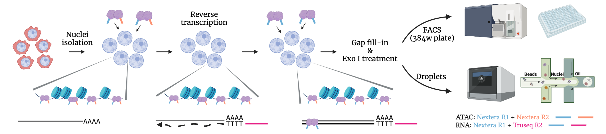

# In Situ SHERRY After ATAC-seq (ISSAAC-seq)
ISSAAC-seq is a single-cell multiomic method for simultaneous profiling of chromatin accessibility and gene expression from the same cell.

(Image created with [BioRender](https://biorender.com/))

## Usage

The repository contains details of the library structures and the code for the data processing and analysis. There are two ways of executing the method with small differences in terms of sample preparation and data preprocessing. Go the the [FACS](https://github.com/dbrg77/ISSAAC-seq/blob/main/FACS.md) page to check the details about the plate-based workflow. Go to the [Droplet](https://github.com/dbrg77/ISSAAC-seq/blob/main/Droplet.md) page to check the droplet-based workflow. In the droplet-based workflow, we used [10x Genomics Single Cell ATAC](https://www.nature.com/articles/s41587-019-0206-z) kit for the demonstration, but it should work on any system with a Tn5 capture sequence, such as [BioRad ddSEQ](https://www.nature.com/articles/s41587-019-0147-6) and [HyDrop](https://www.biorxiv.org/content/10.1101/2021.06.04.447104v1).

## Raw Data Availability

Sequencing data can be downloaded from ArrayExpress under the accession number [E-MTAB-11264](https://www.ebi.ac.uk/arrayexpress/experiments/E-MTAB-11264).

## Citation

Xu W, Yang W, Zhang Y, Chen Y, Zhang Q, Wang X, Song K, Jin W\* and Chen X\* (2021) ISSAAC-seq enables sensitive and flexible multimodal profiling of chromatin accessibility and gene expression in single cells. ___bioRxiv___, [doi: 10.1101/2022.01.16.476488v1](https://www.biorxiv.org/content/10.1101/2022.01.16.476488v1)

## Contact

Xi Chen  
chenx9@sustech.edu.cn
